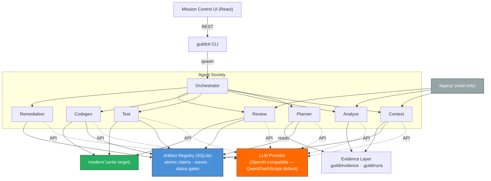

# Migration Guild

**Evidence-gated, multi-agent legacy modernization.** Migration Guild orchestrates a society of AI agents that migrate legacy codebases (Java/Spring today, Python next) file-by-file — but no agent is allowed to *claim* progress. Every status transition must be backed by evidence in a shared SQLite registry, and a Builder → Critic → Arbiter gate decides what actually counts as "migrated."

Your legacy source is never touched: agents read from `legacy/`, write to `modern/`, and the registry keeps the audit trail.

## Why evidence-gated?

Most agentic migration demos trust the model's self-report ("done ✅"). Migration Guild inverts that: intent is cheap, evidence is required. Agents must file dependency scans, classification signals, tests, and review verdicts before the arbiter lets an artifact advance. Failed work is released back to the pool via lease-expiring claims, so a crashed agent never deadlocks the pipeline.

## Key features

- **Blackboard architecture** — agents coordinate through a shared SQLite registry (WAL mode), not through chat. Atomic claims with lease tokens, heartbeats, and attempt counters make parallel agents safe.
- **Four-phase pipeline** — `inventory` (scan & classify) → `plan` (dependency waves) → `migrate` (tests-first codegen) → `review` (independent critic + arbiter gate).
- **Stack packs** — pluggable per-stack rules (`stacks/java-spring`, `stacks/python`): classification heuristics, framework mappings, audit rules, and scaffold templates.
- **Provider-neutral** — any OpenAI-compatible endpoint (DashScope/Qwen, OpenRouter, OpenAI, local llama.cpp/LM Studio) or an agent CLI harness.
- **Mission Control UI** — a React dashboard over the registry: wave plans, live sessions, run logs, blockers.
- **Tested where it hurts** — ~30 test files covering claim leases, evidence gates, arbiter verdicts, pipeline failures, and harness selection.

## Quick start

```bash
git clone https://github.com/iserifith/migration-guild.git
cd migration-guild
npm install
cd migration && npm install && npm run build && cd ..

cp .env.example .env   # set your API key (DashScope / OpenRouter / OpenAI / local)

node migration/dist/guildctl/cli.js --help
```

Then point it at a legacy repo and run the pipeline phase by phase. The full walkthrough — setup wizard, workspace layout, per-phase commands — is in **[GETTING-STARTED.md](GETTING-STARTED.md)**. Contributor docs live in **[DEVELOPMENT.md](DEVELOPMENT.md)**; agent roles are specified in **[AGENTS.md](AGENTS.md)**.

## Architecture



## Pipeline at a glance

| Phase | Command | What must be true to pass |
|---|---|---|
| Inventory | `guildctl inventory` | Every file classified (kind, role, framework) with signals recorded |
| Plan | `guildctl plan` | Dependency graph resolved; artifacts assigned to executable waves |
| Migrate | `guildctl migrate` | Tests written first; code lands in `modern/`; evidence filed |
| Autonomous queue | `guildctl auto-run` | Dependency-ready artifacts run sequentially through bounded migrate, verify, repair, and independent review loops |
| Review | `guildctl review` / `arbitrate` | Independent critic verdict; arbiter gate approves or sends to `needs-rework` |

`guildctl status` and `guildctl watch` show live progress; `guildctl remediate` recovers stalled or failed artifacts.

`guildctl auto-run` is fail-closed and silence-first: it emits one final summary, continues independent work after an artifact blocks, and stops on systemic executor errors without dispatching another artifact. Only `reviewed`, `completed`, or `skipped` dependencies unlock downstream work; a merely `migrated` artifact must still pass independent review. Migrated crash states resume automatically before fresh planned work. Use `--wave` and `--limit` for bounded canaries; `--no-resume` exists only for diagnostic runs that intentionally leave migrated state untouched.

## Roadmap

- **Runtime evidence tier (environment-in-the-loop).** Today the evidence gates are fed by static and registry evidence. Next: an environment agent that builds and executes migrated modules in an isolated sandbox, files build/test/runtime logs as first-class evidence, and routes failures by class (config → env self-repair, semantic → codegen, behavioral → test agent). This follows the direction argued in [*Environment-in-the-Loop: Rethinking Code Migration with LLM-based Agents*](https://arxiv.org/abs/2602.09944) — Migration Guild already provides the coordination substrate (registry, claims, arbiter) that paradigm needs.
- Python stack pack parity with java-spring.
- Pinned-fixture stress suite against real brownfield repos.

## Tech stack

TypeScript / Node.js 18+ · SQLite (WAL) · OpenAI-compatible APIs · React (Mission Control)

## License

MIT
