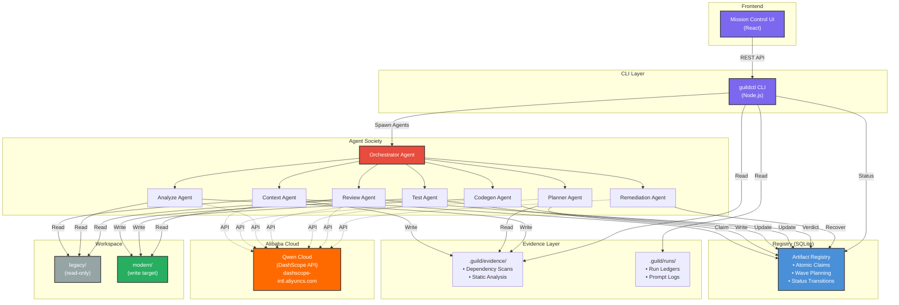

# Migration Guild

A multi-agent system for evidence-gated legacy modernization.

## Quick Start

```bash
git clone https://github.com/iserifith/migration-guild.git
cd migration-guild
npm install
cd migration && npm install && cd ..
npm run build
node migration/guildctl/dist/cli.js --help
```

## Architecture



## Tracks

**Track 3: Agent Society** — Multi-agent coordination through a shared registry

## Tech Stack

- **TypeScript** / Node.js
- **SQLite** (WAL mode, concurrent reads)
- **OpenAI-compatible API** (Qwen Cloud / DashScope)
- **React** (Mission Control UI)

## License

MIT
...
